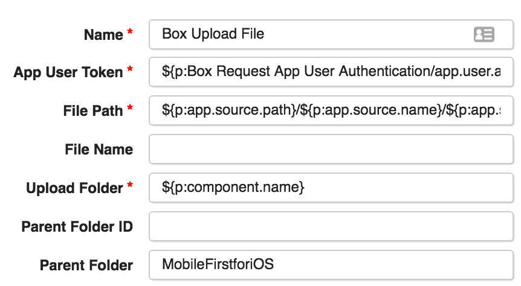

# Box Utilities Plugin
***

## About
***
**Plugin:** Box Utilities  
**Author:** Timothy Bula  
**Date:** 02/05/16
 
 

## Purpose
***
The Box Utiliies plugin provides integration with Box via Web Services, utilizing the Box Java-SDK. Version 1 of the the plugin has support for multi-step user authentication and file upload operations.

##Helpful Links
***
[Box Content API Documentation](https://box-content.readme.io/reference "General overview")   
[Box Java SDK](https://github.com/box/box-java-sdk)

##  Box Account Requirements
***
***Guide: [Box Platform](https://box-content.readme.io/docs/box-platform "Start of the box platform information")***
  
1. Box Developer Account. I requested mine directly through Box representatives.   
2. Box Developer Application  
3. App Auth and App Users enabled   
4. Box App configured

## Scripts
***
###boxSendAuthenticationCallEnterprise.groovy
***Performs the first leg of authentication***
 
1. Creates Enterprise JWT assertion with provided information from Box app settings  
2. Requests authentication  
3. Uses auth token to search for App Users on the developer account that matches one provided by user  
4. Prints matching App User Id to the log

###boxSendAuthentcationCallAppUser.groovy
***Peforms second leg of authentication and allows Content API to be used***
  
1. Uses App User Id to create User JWT assertion  
2. Requests authentication  
3. Prints auth token to log 

###boxUploadFile.groovy
***Uploads file to box account***

1. Establishes connection to Box with auth token  
2. Searches for parent folder of the folder we want to upload the file to
3. Searches for upload folder in parent folder. Creates upload folder if it doesn't exist
4. Performs preflight check on file to be upload (file size, naming conflicts, etc.)
5. Uploads file to Box
6. Prints uploaded file id to console

###boxGetFileDownloadUrl.groovy
***Uploads file to box account***

1. Establishes connection to Box with auth token  
2. Finds the file by id
3. Creates sharedlink and gets direct download url
5. prints direct download url to the logs
 

 
## Plugin  
***

###Enterprise Authentication Step
***
  

* **Entity ID** - enterpriseID on account info tab on Admin Console  
* **Client ID** - application’s client_id. Available on application settings webpage
* **Client Secret** - application’s client_secret. Available on application settings webpage
* **Public Key ID** - created when adding public key to application. 
* **Private Key** - generated locally 
* **Private Key Path** - private key must be added to the UCD step to create the file
* **Private Key Password** - set private key in settings if desired
* **App User Name** - name of app user on the developer enterprise account. Will be created on the enterprise account if not found. Needed for Content API

###App User Authentication Step
***

* **App User ID** - unique ID associated with the App User. Output of Enterprise Authentication step and required to get auth token.   

###Upload File Step
***
 

* **App User Token** - output of App User authentcation step
* **File Path** - path to file to upload
* **File Name** - filename if desired to be different from the one defined in the path
* **Upload Folder** - name of folder file to be upload to. Will be created if not found in the parent folder. 
* **Parent Folder ID** - provides safe way to locate upload folder in case of duplicate folder names in the folder structure. Can be found in the url when on the folder on box webapp. 
* **Parent Folder** - name of folder that the upload folder is in. Only guarenteed to be correct folder if it is unique

###Get File Download URl Step
***

